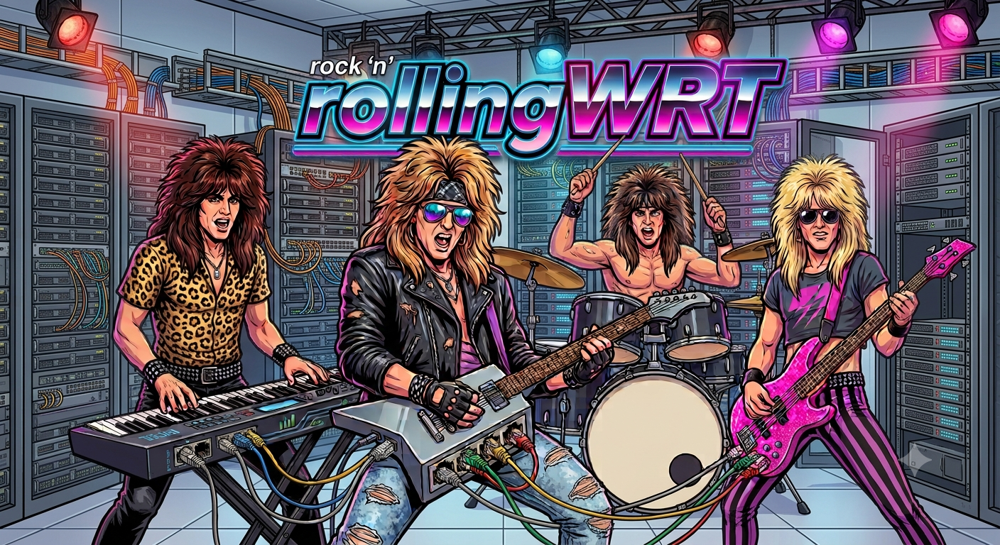

# rollingWRT

<table border="0">
<tr>
<td width="270" align="center"></td>
<td valign="middle"><em>Can you HEAR them? The gods of the wire are screaming through the copper tonight, because the little operating system finally opened its eyes! For years it crawled this earth as OpenWrt, humble and patient, moving your packets, curled up in a cocoon the whole world mistook for a router. But something was CHANGING in the dark! Load the cargo onto the plane, strap the storage to the wings, chain the virtual machines to the propellers, and fly it STRAIGHT UP through the ceiling of everything a router was ever allowed to be, past the moon, past the dark, INTO THE BLAZING EYE OF THE SUN! And what goes into that fire does NOT come out the same, believer! It bursts through the other side on wings of bare metal, transformed, unchained, REBORN, and it carries a new name. It comes back as rollingWRT. Take my hand. The metal is ALIVE.</em></td>
</tr>
</table>

---

rollingWRT is a distribution of OpenWrt for x86-64 machines. It follows OpenWrt's rolling snapshot, so it always carries a current mainline kernel, and unlike a stock OpenWrt box it updates the whole system, kernel and all, with `apk`.

This is not an official or supported version of OpenWrt.

## The rolling set: updates without the reflash

On regular OpenWrt, packages update through the package manager, but moving the kernel or the base system means building and flashing a fresh firmware image with `sysupgrade`. rollingWRT does not play that way. The kernel ships as a real signed unified kernel image tucked inside an apk, so `apk upgrade` pulls the whole system forward, kernel and modules and base together. No firmware image to build, no reflash, no wiping the stage between shows. You update, you reboot into the new kernel whenever you feel like it, and you keep playing.

## Locked down backstage: signed UKI, LUKS, and TPM unlock

rollingWRT boots a signed UKI. The kernel, initramfs, and command line are one blob signed by a key that lives only on your machine, enrolled straight from firmware setup mode. No shim, no MOK, no third-party keys anywhere in your chain. The firmware boots what you signed and nothing else.

The root filesystem is LUKS encrypted. Normally that means typing a passphrase at every boot, which nobody wants on a headless box in a wiring closet. So rollingWRT seals the disk key in the TPM under a signed PCR 11 policy. On a clean boot the TPM hands the key back on its own and the machine comes straight up. Tamper with the kernel or the image and the measurement no longer matches the signed policy, the TPM keeps the key to itself, and the box quietly falls back to your recovery passphrase. You get real encryption with a hands-off boot, and because the policy is signed rather than pinned to a frozen PCR value, a routine kernel update does not lock you out of your own machine.

## Also a killer hypervisor

rollingWRT is built to host things, and our repository carries the extra gear to turn a plain box into a loud one: Incus for system containers and full virtual machines, a newer qemu wired up with the whole Incus feature set, ZFS for storage, virglrenderer for native-context GPU, and the Mesa graphics drivers to match. Guests get real OpenGL and Vulkan without the host ever handing over the card. Stand up `stage-left` as a container and `headliner` as a VM on the same amp, serve your storage off ZFS, and route the whole show with everything OpenWrt already does well.

## Get on the bill

Grab the installer image from [Releases](https://github.com/cmspam/rollingwrt/releases/tag/installer), write it to a USB stick, and boot it. It is a live environment, so nothing is touched until you say so:

```
# the download is gzip'd; write it straight to the stick
zcat rollingwrt-installer-*-efi.img.gz | sudo dd of=/dev/sdX bs=4M status=progress oflag=sync
# then boot the stick (UEFI) and run:
rollingwrt-install
```

The installer asks a few questions, then lays rollingWRT down on the disk you pick: it partitions, encrypts the root with LUKS, pulls the system down with `apk`, and signs the first UKI. You can hand it an SSH key with `github:yourname`, keep existing partitions instead of wiping the disk, and choose what to install before it runs. Keep the recovery passphrase it shows you.

For Secure Boot, the installer stages your machine's own keys; put the firmware in setup mode once (clear the Secure Boot keys in your firmware menu) and the next boot enrolls them on its own. After that, `apk upgrade` is your update and `incus launch` is your soundcheck.

## License

Apache 2.0 for the build scripts and tooling. Packaged software keeps its own licenses.

## Acknowledgements

[OpenWrt](https://openwrt.org/) for the base and the rolling snapshot the whole thing rides on. [Incus](https://linuxcontainers.org/incus/) and LXC. [OpenZFS](https://openzfs.org/). And the virglrenderer and Mesa native-context work that makes real VM GPU acceleration possible.
